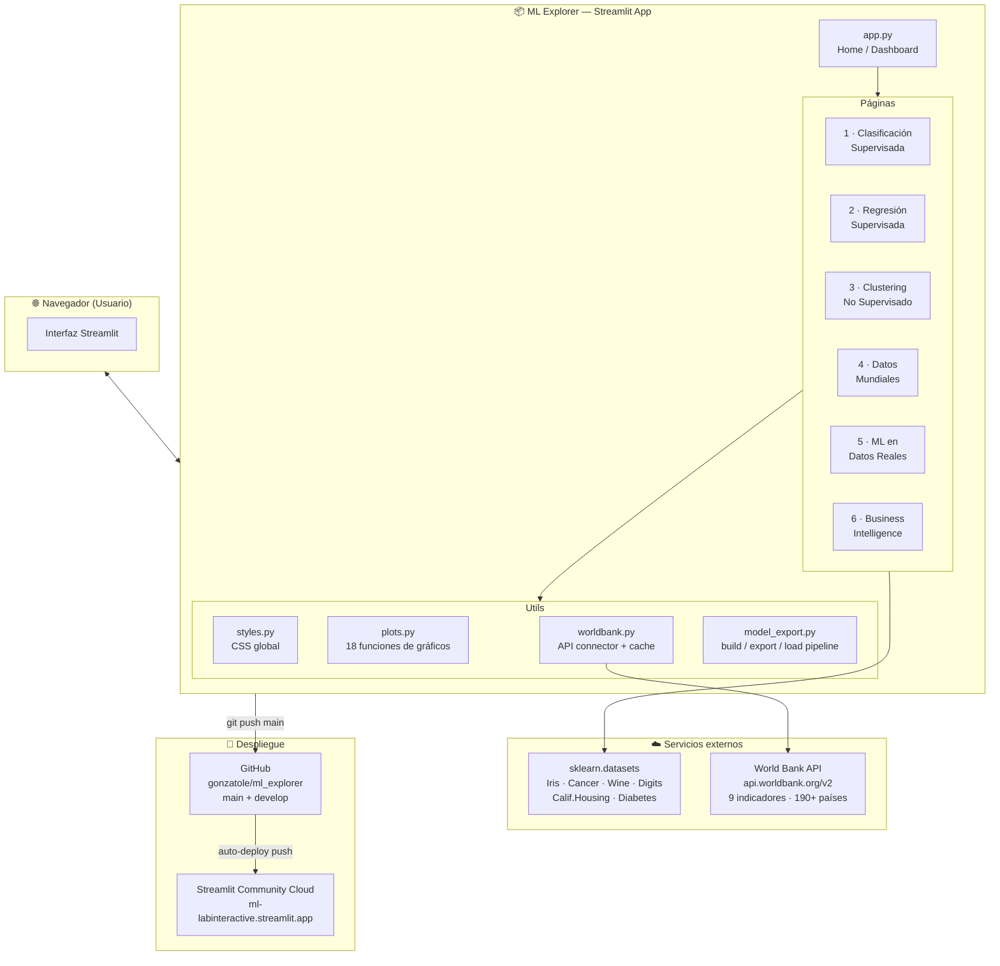
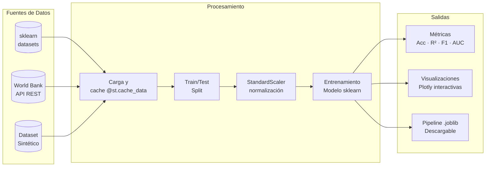
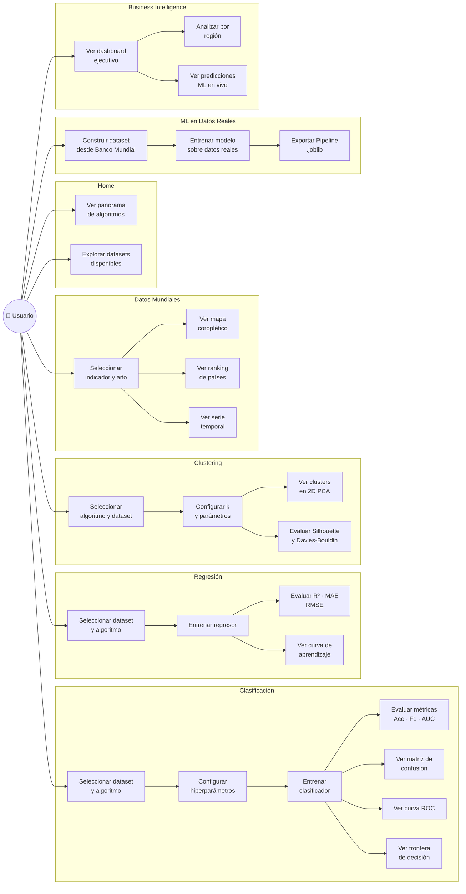
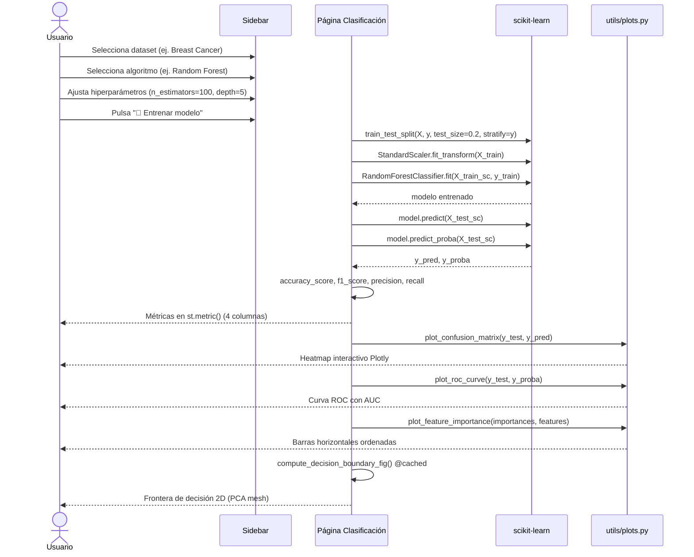
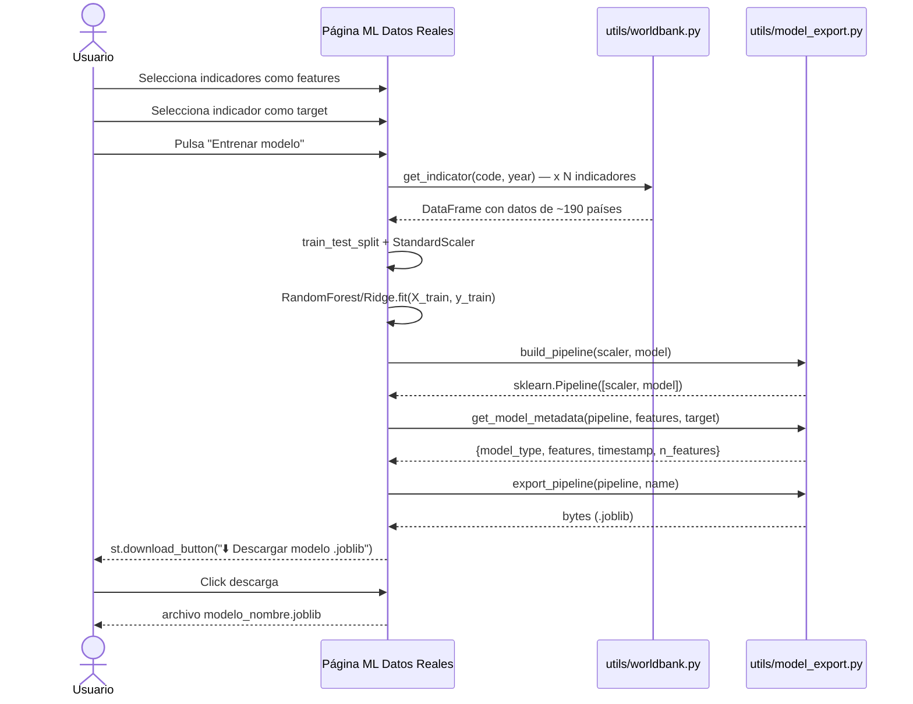
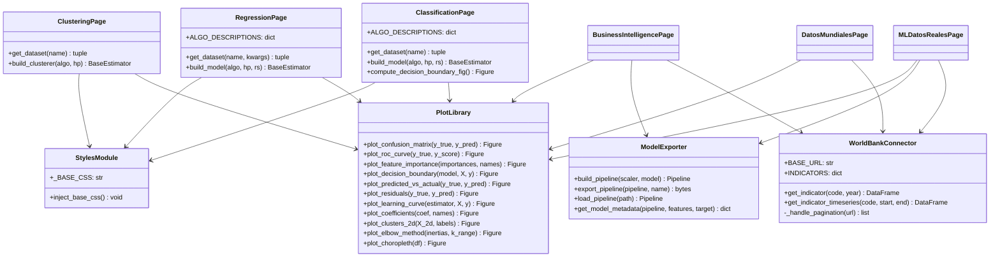
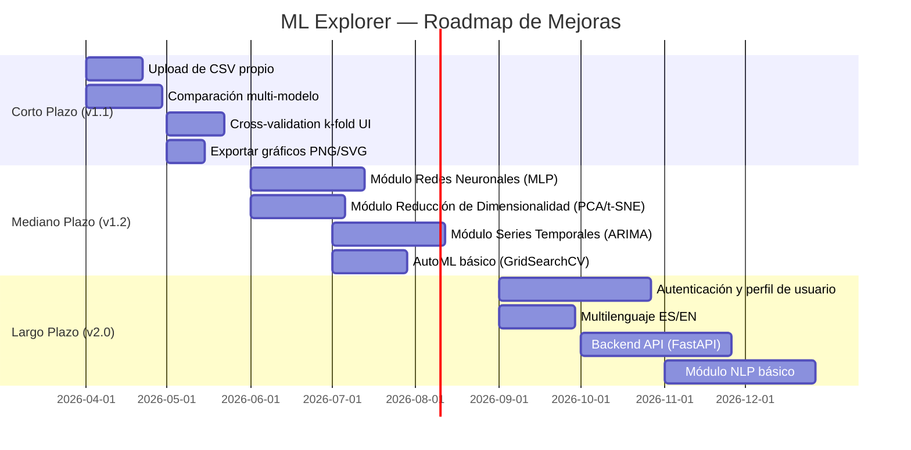

# Informe de Software — ML Explorer
**Versión:** 1.0.0  
**Fecha:** 2026-04-07  
**Repositorio:** github.com/gonzatole/ml_explorer  
**Despliegue:** ml-labinteractive.streamlit.app  
**Stack:** Python 3.11 · Streamlit 1.32 · scikit-learn 1.4 · Plotly 5.20

---

## 1. Resumen Ejecutivo

ML Explorer es una aplicación web interactiva de laboratorio de Machine Learning construida sobre Streamlit. Permite a usuarios —desde estudiantes hasta profesionales— explorar, entrenar y evaluar algoritmos de ML clásicos sin escribir una línea de código. La aplicación integra datos de entrenamiento tanto sintéticos/académicos (sklearn datasets) como datos reales del mundo (API del Banco Mundial), y soporta exportación de modelos entrenados como Pipelines sklearn reutilizables.

| Dimensión | Detalle |
|-----------|---------|
| Módulos principales | 6 páginas + 1 home |
| Algoritmos cubiertos | 12 (5 clasificación · 5 regresión · 3 clustering) |
| Datasets integrados | 7 (4 sklearn + California Housing + Diabetes + Sintético) |
| Fuentes de datos externas | API Banco Mundial (9 indicadores, 190+ países) |
| Visualizaciones únicas | ~18 tipos de gráficos Plotly/Matplotlib |
| Exportación de modelos | Pipeline sklearn serializado (.joblib) |

---

## 2. Arquitectura del Sistema

### 2.1 Diagrama de Componentes

### 2.2 Diagrama de Flujo de Datos

---

## 3. Descripción de Módulos

### 3.1 Home (`app.py`)
Página de bienvenida con:
- Hero visual + tarjetas de navegación a los 6 módulos
- Explicación conceptual de ML supervisado vs no supervisado
- Gráfico de burbujas interactivo: Interpretabilidad vs Flexibilidad (12 algoritmos)
- Vista previa de los 4 datasets sklearn con scatter plots

### 3.2 Módulo 1 — Clasificación Supervisada
**Algoritmos:** Logistic Regression, Decision Tree, Random Forest, KNN, SVM  
**Datasets:** Iris (150×4), Breast Cancer (569×30), Digits (1797×64)  
**Hiperparámetros configurables:** C, kernel, max_depth, n_estimators, k, solver, criterion  
**Visualizaciones:**
- Matriz de confusión normalizada (Plotly heatmap)
- Curva ROC (binaria + multiclase One-vs-Rest)
- Importancia de variables / coeficientes
- Frontera de decisión 2D (PCA + mesh grid)
- Reporte de clasificación detallado

### 3.3 Módulo 2 — Regresión Supervisada
**Algoritmos:** Linear Regression, Ridge (L2), Lasso (L1), Decision Tree, Random Forest  
**Datasets:** California Housing (20640×8), Diabetes (442×10), Sintético (configurable)  
**Métricas:** R², MAE, MSE, RMSE  
**Visualizaciones:**
- Scatter Predicho vs Real con línea de predicción perfecta
- Residuos vs Predichos + histograma de distribución
- Coeficientes signados (barras verde/rojo)
- Curva de aprendizaje con bandas de confianza (5-fold CV)

### 3.4 Módulo 3 — Clustering No Supervisado
**Algoritmos:** K-Means, DBSCAN, Agglomerative Clustering  
**Datasets:** Iris, Blobs, Moons, Circles (sintéticos)  
**Métricas:** Silhouette Score, Davies-Bouldin Score, Calinski-Harabasz Score  
**Visualizaciones:**
- Scatter 2D coloreado por cluster (PCA)
- Método del Codo (inercia vs k)
- Soporte de detección de ruido DBSCAN (label -1 → "Ruido")

### 3.5 Módulo 4 — Datos Mundiales
**Fuente:** World Bank API (gratuita, sin API key)  
**Indicadores:** PIB per cápita, Esperanza de vida, GINI, Desempleo, CO₂, Educación, Electricidad  
**Visualizaciones:**
- Mapa coroplético mundial (Plotly Geo, proyección Natural Earth)
- Ranking top/bottom países por indicador
- Series temporales 2000–2023 por país
- Comparador de indicadores entre países

### 3.6 Módulo 5 — ML en Datos Reales
**Flujo:** selección de indicadores Banco Mundial → features + target → entrenamiento → evaluación  
**Tipos:** regresión y clasificación (umbral configurable)  
**Exportación:** Pipeline sklearn (.joblib) descargable vía `st.download_button`  
**Metadata:** tipo de modelo, features usadas, timestamp, has_importances

### 3.7 Módulo 6 — Business Intelligence
**Enfoque:** dashboard ejecutivo para análisis gerencial  
**Visualizaciones:**
- KPIs globales en tiempo real
- Análisis regional (América Latina, Europa, Asia, etc.)
- Tendencias temporales multi-país
- Predicciones ML en vivo sobre datos actuales

---

## 4. Diagrama de Casos de Uso

### 4.1 Vista General del Sistema

### 4.2 Caso de Uso Detallado: Entrenar Clasificador

### 4.3 Caso de Uso Detallado: Exportar Modelo

---

## 5. Diagrama de Clases / Módulos

---

## 6. Stack Tecnológico

| Capa | Tecnología | Versión | Rol |
|------|-----------|---------|-----|
| UI / Framework | Streamlit | 1.32.0 | Servidor web + componentes reactivos |
| ML Engine | scikit-learn | 1.4.1.post1 | Algoritmos, métricas, pipelines |
| Datos tabulares | pandas | 2.2.1 | Manipulación de DataFrames |
| Álgebra lineal | numpy | 1.26.4 | Operaciones vectoriales |
| Visualización interactiva | plotly | 5.20.0 | Gráficos web interactivos |
| Visualización estática | matplotlib + seaborn | 3.8.3 / 0.13.2 | Dígitos (imshow), heatmaps |
| Serialización modelos | joblib | 1.3.2 | Exportar/cargar Pipelines |
| API externa | requests | 2.31.0 | Llamadas Banco Mundial |
| Runtime | Python | 3.11 | Especificado en runtime.txt + .python-version |
| CI/CD | GitHub + Streamlit Cloud | — | Auto-deploy en push a main |

---

## 7. Proyección de Mejoras

Las mejoras están organizadas en 3 horizontes de tiempo con prioridad por impacto.

### 7.1 Roadmap Visual

### 7.2 Mejoras Corto Plazo — v1.1 (1–2 meses)

| # | Mejora | Impacto | Esfuerzo | Descripción |
|---|--------|---------|----------|-------------|
| 1 | **Upload de CSV propio** | Alto | Bajo | Agregar `st.file_uploader` en páginas 1, 2 y 3 para que el usuario entrene sobre sus propios datos |
| 2 | **Comparación multi-modelo** | Alto | Medio | Panel para entrenar los 5 algoritmos en paralelo y mostrar tabla comparativa de métricas |
| 3 | **Cross-validation k-fold en UI** | Alto | Bajo | Añadir opción de CV con k configurable además del simple train/test split |
| 4 | **Exportar gráficos** | Medio | Bajo | Botón de descarga PNG/SVG para cada gráfico Plotly vía `fig.to_image()` |
| 5 | **Tooltips educativos en métricas** | Medio | Bajo | Expandir `help=` de `st.metric()` con ejemplos concretos (ej. "AUC=0.97 → excelente") |

### 7.3 Mejoras Mediano Plazo — v1.2 (3–5 meses)

| # | Mejora | Impacto | Esfuerzo | Descripción |
|---|--------|---------|----------|-------------|
| 6 | **Módulo Redes Neuronales (MLP)** | Muy alto | Alto | `sklearn.neural_network.MLPClassifier/Regressor` con visualización de arquitectura y curva de pérdida |
| 7 | **Reducción de Dimensionalidad** | Alto | Medio | Nuevo módulo con PCA (varianza explicada, biplot), t-SNE y UMAP interactivos |
| 8 | **AutoML con GridSearchCV** | Alto | Medio | Panel de búsqueda de hiperparámetros con heatmap de resultados (CV score vs params) |
| 9 | **Series Temporales** | Alto | Alto | Nuevo módulo con Prophet o statsmodels ARIMA, descomposición trend/seasonality, forecast |
| 10 | **Matriz de correlación interactiva** | Medio | Bajo | Heatmap clickeable en páginas 1 y 2 para analizar relaciones entre features antes de entrenar |
| 11 | **Modo oscuro / claro toggle** | Bajo | Bajo | Añadir selector de tema en sidebar (ya existe base CSS dark) |

### 7.4 Mejoras Largo Plazo — v2.0 (6–12 meses)

| # | Mejora | Impacto | Descripción |
|---|--------|---------|-------------|
| 12 | **Backend FastAPI** | Transformador | Desacoplar la lógica ML de Streamlit. Exponer endpoint `/predict` para que los modelos exportados sean consumibles desde el SaaS dashboard (Next.js) |
| 13 | **Autenticación + perfiles** | Alto | Login con Streamlit-Authenticator. Guardar historial de experimentos por usuario en SQLite/Supabase |
| 14 | **Módulo NLP** | Alto | Clasificación de texto con TF-IDF + Naive Bayes / Logistic Regression. Dataset de sentimientos. Wordcloud |
| 15 | **Multilenguaje ES/EN** | Medio | Diccionario de i18n, selector en sidebar |
| 16 | **Historial de experimentos** | Medio | Persistir parámetros + métricas de cada entrenamiento en sesión. Tabla comparativa de runs |
| 17 | **Modo educativo guiado** | Alto | Tutorial paso a paso por módulo con hints contextuales y quiz de comprensión |

### 7.5 Deuda Técnica

| Item | Prioridad | Descripción |
|------|-----------|-------------|
| Tests unitarios | Alta | Agregar `pytest` con tests para `utils/plots.py`, `utils/worldbank.py` y `utils/model_export.py` |
| Caché de API offline | Media | Guardar respuestas del Banco Mundial en `data/cache/` como `.parquet` para funcionar sin internet |
| Lazy imports en páginas | Media | Mover `from sklearn...` dentro de las funciones para acelerar el cold-start de cada página |
| `models/` directorio | Baja | Crear estructura para guardar pipelines exportados localmente con versionado |

---

## 8. Métricas del Proyecto

| Métrica | Valor |
|---------|-------|
| Líneas de código Python (sin venv) | ~1,800 |
| Archivos Python del proyecto | 11 |
| Commits en main | 3 (v1.0.0 + fixes deploy) |
| Ramas activas | main (producción), develop (integración) |
| Cobertura de tests | 0% — pendiente v1.1 |
| Tiempo de cold-start estimado | ~8s (carga sklearn + pandas en Cloud) |
| Indicadores Banco Mundial | 9 |
| Tipos de gráficos únicos | 18 |

---

## 9. Dependencias y Riesgos

| Riesgo | Probabilidad | Impacto | Mitigación |
|--------|-------------|---------|------------|
| API Banco Mundial no disponible | Baja | Alto | Implementar fallback con datos cacheados en `.parquet` |
| Streamlit Cloud actualiza Python | Media | Alto | `runtime.txt` + `.python-version` fijan Python 3.11 |
| scikit-learn depreca API | Baja | Medio | Versión fijada en requirements.txt |
| Límite de tiempo CPU en Streamlit Community | Media | Medio | `@st.cache_data` en todas las operaciones costosas |
| Windows App Control bloquea DLLs sklearn | Alta (local) | Bajo | Solo afecta dev local en Windows con Smart App Control activo |

---

*Generado automáticamente para ML Explorer v1.0.0 · 2026-04-07*
